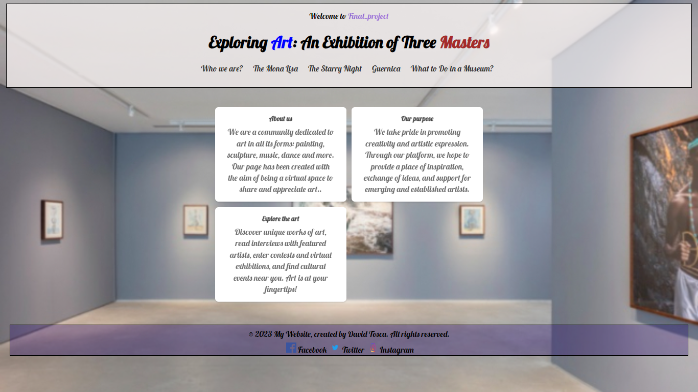

## 📗 My Final Project with astro 📗


[](https://final-projectdavidtosca.vercel.app/)                [](https://tosquit-literate-waffle-65jxp7gvrrwf5pv5.github.dev/)



## 🚀 Project Structure

Inside of your Astro project, you'll see the following folders and files:

```
/
├── public/
│   └── Facebook.png
│   └── Instagram.png
│   └── Twitter.png
│   └── PantallaPrincipal.png
│   └── Guernica.jpg
│   └── MonaLisa.jpg
│   └── NitEstrellada.jpg
│   └── Back.jpg
│   └── favicon.svg
│   └── global.css
├── src/
│   ├── components/
│   │   └──Card.astro
│   │   └── GeneralPage.astro
│   │   └──TodoList.jsx
│   │   └──listyle.css
│   │   └── script.js
│   ├── layouts/
│   │   └── Header.astro
│   │   └── Layout.astro
│   │   └── Footer.astro
│   └── pages/
│       └── index.astro
│       └── Guernica.astro
│       └── LaMonaLisa.astro
│       └── LaNocheEstrellada.astro
│       └──Todo.astro
└── package.json
```
## 👀 Author: David Tosca

